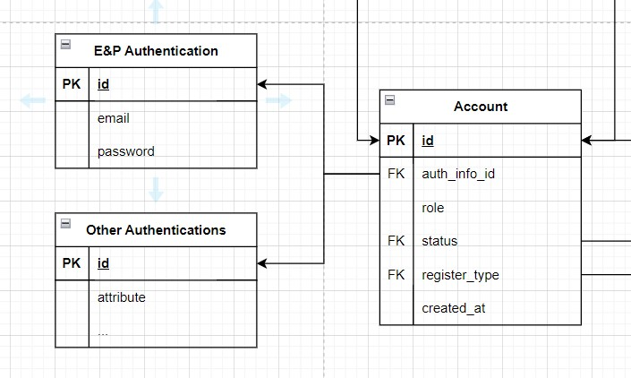
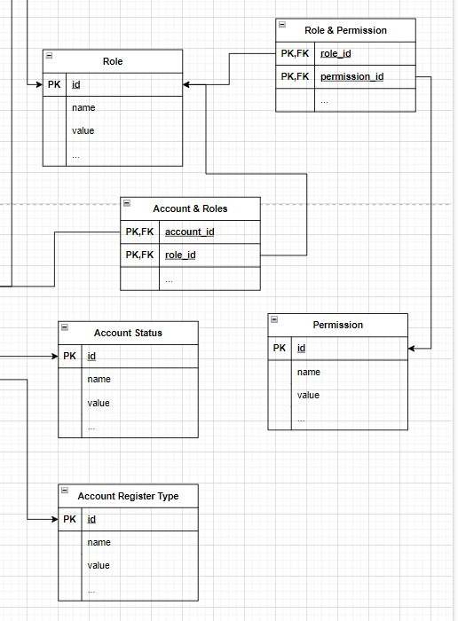
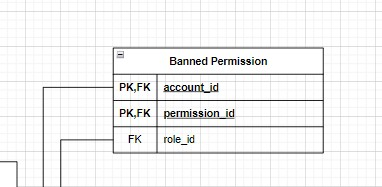
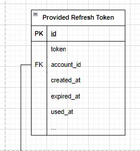
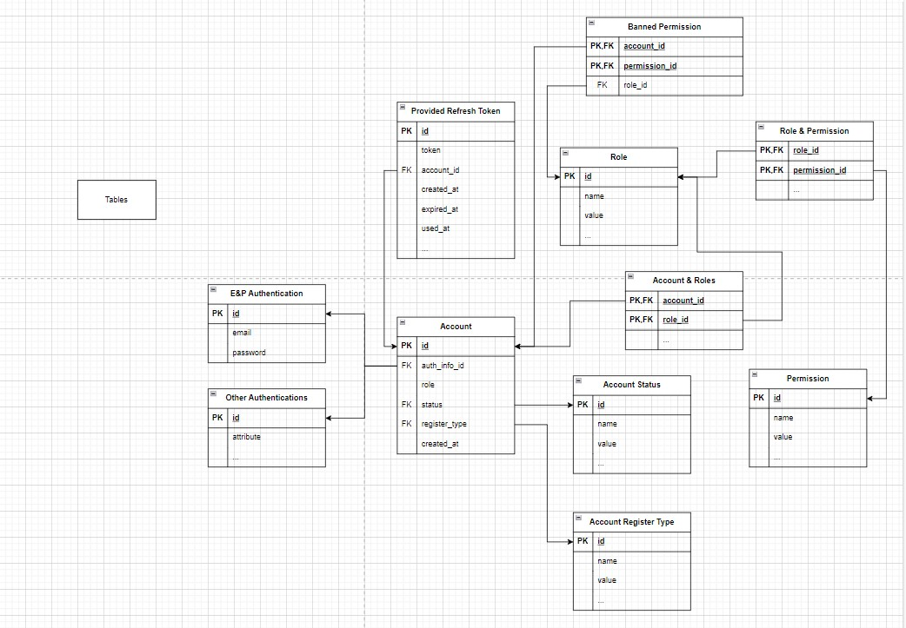
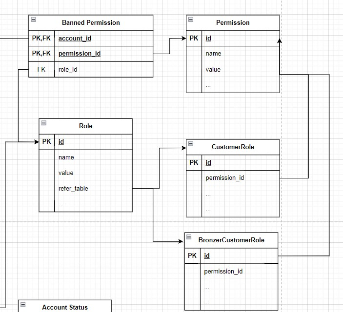
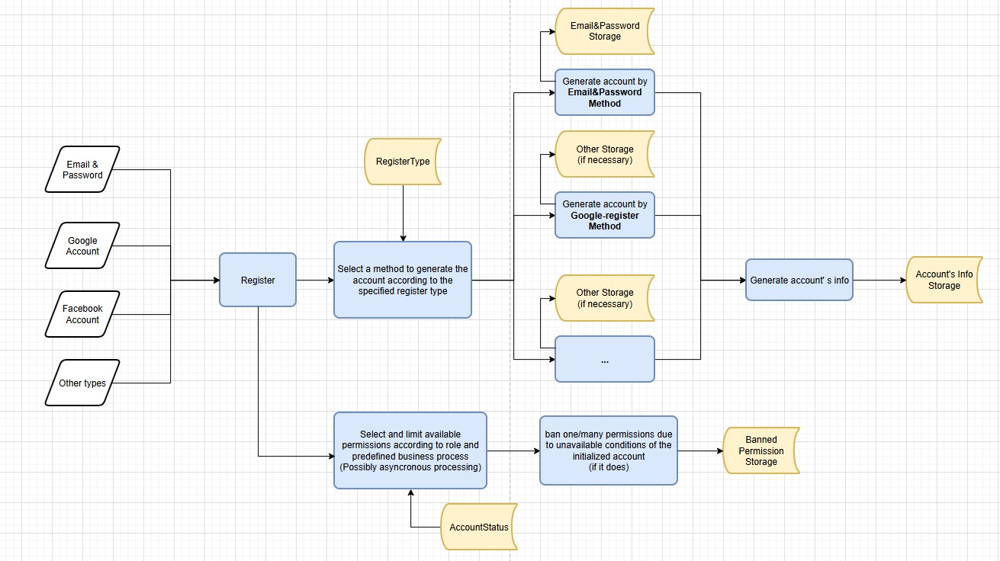
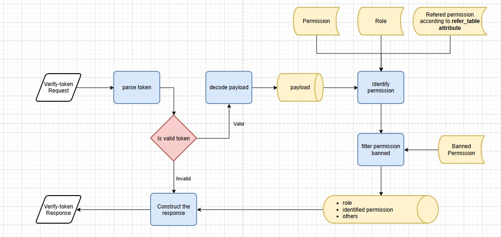
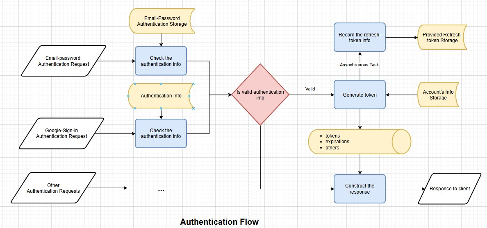

# Callcenter - Auth Service

## Introduction

### About the previous project - [Callcenter project](https://github.com/MiwaUS7605/fit_20clc_hcmus_software_architecture) and [callcenter_microservices](https://github.com/PHoaiLe/call_center_microservices)

Callcenter is a system that provides a mobile app interface to clients to book plenty of pickups, 
a mobile app interface to drivers, and a desktop interface to operators who record, and monitor pickup’s status. 
 

It started on 2023/07/16 and be closed on 2023/10/08. The project meet the demand of academic level,
which was built on Android OS minimum SDK is API 28, by Java and Android Studio. 
The desktop app was built on .NET, C#. The Server was built on Spring-Spring Boot v3.0.5, 
supported by using Maven and Firebase SDK Admin, and applied Event-Driven architecture by using Apache Kafka, local repository
dependency, FCM for notification, and microservice architecture.
 

By some reasons, the team used Firebase Cloud Services as the major service to handle Authentication and Authorization Services.
This approach provided fast and convenient solution for us to quickly apply into our system, which accelerated the implementation
process and meet requirements of the course at that time.

### Why I make this Auth Service repository?
Since the **[callcenter_microservices](https://github.com/PHoaiLe/call_center_microservices)** focused on how services/components in the system connect together and the way that requests/messages 
from the client are sent through the services in a business executing process by applying Event-Driven Architecture thanks to Apache Kafka implementation.
This time, a self-study project, we are going to alter some components depending on the Firebase services and also the Firebase Database 
by self-implementation elements that provide the same roles/functions. Obviously, although this creates some problems/questions that we have to solve in the process of implementation,
it also gives us chances to face some challenges that we were lucky to be solved by third-party services.
 

## Expectations
As a self-study project, the intended aim is to concentrate on a well-built service as much as possible that can be applied in the production environment, 
which requires qualified knowledge and skill in understanding the framework, technologies,... and how we design and implement the system.
I'm also willing to learn and apply new technologies to this project to improve it so there are expectations below
 

- Create a well-built Auth Service
- The service source code can be easily extended in the future

[//]: # (- The service will be deployed on AWS EC2)
- Gaining comprehensive knowledge of authentication and authorization in a system
- Knowledge of Spring (Spring Boot) framework
- .etc
 

## Requirements

Detail

- Create a service that can accept multiple ways of authentication. At the beginning, the service provides an email-password authentication method. In the future, however,
the service can give the ability to scale the authentication method without affecting the current implementation. Each
method may require different schema to handle its own business, which requires the service can adapt a new schema and easily adjust it into the schema used
for account storage.
- Authorization without the estimated amount of roles. In reality, when a system becomes larger or provides services to external consumers, it brings a challenge to the Auth service
that must handle the larger amount of roles or permissions inserted. It is not ideal to change or refactor on-working features for adding new roles or looking into each API to replace
the current logical flow every time one role be considered.
- Applying refresh token rotation implementation, which adapts requirements at basic level.
- Handle multiple requests, apply Non-blocking I/O

[//]: # (- Verify token or authorization via gRPC)
- Implement clean, scalable, easily maintained source code
- 
- (*) Requirements will be improved later
-  

## Approach

### How to adapt multiple authentication methods

Solution and explanation

-   At the first requirement, we mentioned the scalability of the authentication method the service is expected to provide.
     **Why do we need this ability?** 
    At the beginning of the process, our service may need to serve one method, the simplest one, email-password authentication. With the natural approach, we can define an Account table that
    each record has email and password attribute. However, if the service need to extend authentication method, this approach forces us to redefine the account table since each authentication
    may require specific storage information for logical and business execution.
    
    One of solution suggested is that we separate authentication information to tables, which store their own information. The account table now will serve an attribute called **"auth_info_id"**
    that refer to authentication tables according to defined condition implemented.

    
    
    Consequently, the service provides the ability to scale on the number of authentication methods without redefined existing tables. For each new method added, changed, or removed, we only execute
    on a separate feature, this won't affect other features in the database and the source code become more flexible by applying suitable design patterns.

### Flexible authorization support

    
<a>Version 1</a>

-   Moreover, we also design tables as Role, Permission, Role_Permission to apply role-permission access control. Since the service is intentionally separated auth service, its goal is to provide 
    remote access control or authorization properly via tokens sent to client services when they send authentication request to the service.

    

    And we added a table called **"Permission-be-limited-of-accounts-for-some-issues Table"** or **"banned-permission"** for short. In some regular use cases like a just-created account, we want to prohibit or limit
    some permissions, features or simply some APIs, we do not want to allow a just-created account of a driver to receive and accept booking request from customers until he/she provide the driving license information which
    is required to activate a driver's account.

    
    
    This is the first version of **Permission-be-limited-of-accounts-for-some-issues Table** :)) We will improve and update this document later
    
    In addition, to serve the refresh token rotation feature, the database should provide a table to store and manage generated refresh tokens when the service receives authentication requests or refresh-token requests.
    The record concentrates on what is the token generated, which account the token belong to, the issued time, expiration, the used time of the token. This is the initialized level and customized version which is based
    on reference of refresh token rotation.

    
    
    The general relationship of featured tables in the database is provided below
    

    
<a>Version 2</a>

-   At the first version (Version 1 of Flexible authorization support), we saw that the Role_to_permission table will contain huge amount of record which used to map permissions to roles
    Thing works well until we meet this use case. First, if we have Customer_Role to indicate basic level of a customer, we want to have upper levels as BronzerCustomer_Role, SilverCustomer_Role, .etc
    
    Now, if the role Customer_Role has a per_A permission, will the BronzerCustomer_Role define per_A in the Role_to_permission table?
    
    #### Role_to_permission table

    - Customer_Role's ID is 1  
    - BronzerCustomer_Role's ID is 2
    - BronzerCustomer_Role extends Customer_Role

    | role_id | permission_id |
    |---| ---|
    | 1        | per_A         |
    | 2        | per_A         |
    | 2        | per_B         |

    (1) Will we declare explicitly permissions of the extended role?

    (2) Or remove the second row and let implementation in source code handle this? Will the approach (2) assist the scalability and maintenance in the future when someone else looks into the table and modifies
    the information. In our opinion, we do not think that is a good idea!
    
    => Mapping all permissions of roles into a single table make thing becomes complicated and hard to maintain or expand later. 
    Instead, we would like to introduce a new approach, which may be considered as a more relevant solution for this situation
    
    
    
    Here, we suggest to split roles into tables, each table holds a list of permissions which are available for its own role. Moreover, we can define some conditions for each permission defined in the table by adding
    other attributes.
    Finally, we reuse the Role table, but this time, the Role table provides a new attribute called "refer_table" that instructs where can we find more details about the role being considered.
    
    **A table which stands for a role will hold their permissions, though it can be a child or extended from other role table** 

        BronzerCustomer extend Customer, but the BronzerCustomer table still hold Per_A and Per_B
    
    The design of database for this approach is showed below

    
    

## Context and Flows

### Register-an-account flow

-> see detail of the flow

-    
    
    
    

### Verify-token flow

-> see detail of the flow

-

### Authentication flow

-> see detail of the flow

-

